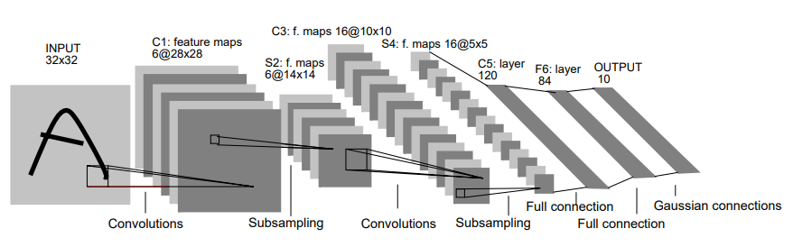

# Lenet 5 Implementation (Lecun et al. 1998)

This project is the implementation of the model Lenet 5 from paper -

**"Gradient-Based Learning Applied to Document Recognition"**

The model Lenet 5 is one of the earliest model which uses CNN architecture to classify images. In the original paper (and here too), the model is been used to classify digits from MNIST dataset

## Overview

The architecture of original model is shown below



*Figure: Original LeNet-5 architecture from LeCun et al., “Gradient-Based Learning Applied to Document Recognition”, 1998.*

Some Changes are made in this implementation according to convinence 

1. **Pooling Layers**  
   - Replaced average pooling (subsampling) with max pooling.

1. **Output Layer**  
   - Replaced the original RBF/Gaussian output units with a `Softmax` layer.

1. **Loss Function**  
   - Replaced Mean Squared Error (MSE) with `CrossEntropyLoss`, which is standard for classification.

1. **Convolution Layer C3**
   - Used fully connected Convolutional Layer instead of partial connections 

## Dataset

The original Model was trained on full MNIST dataset of 60000 training images and 10000 test images, however in this implementation it has been trained on 10000 images and tested from 2500 images from MNIST dataset. The images are padded from 28 x 28 to 32 x 32 as in the original model

## Performance

Original Lecun-98 reported a 99.2% accuracy

This implementation has reported a accuracy of 92.3%, in which might be due to a smaller training set used, and the model being trained for a smaller number of epochs

## Installation

```bash
git clone https://github.com/Vidit-01/lenet-5-implementation.git
cd lenet-5-implementation
pip install -r requirements.txt
```

## Usage

```bash
python main.py
```

## Citation
If you use this implementation, please cite the original work:

> Yann LeCun, Léon Bottou, Yoshua Bengio, and Patrick Haffner.  
> *Gradient-Based Learning Applied to Document Recognition.*  
> Proceedings of the IEEE, 1998.  
> [PDF Link](http://yann.lecun.com/exdb/publis/pdf/lecun-98.pdf)


